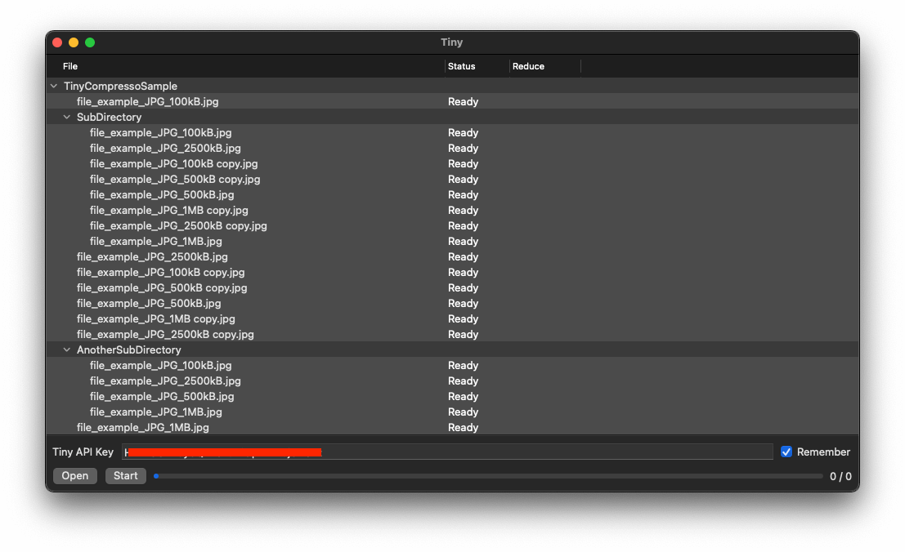
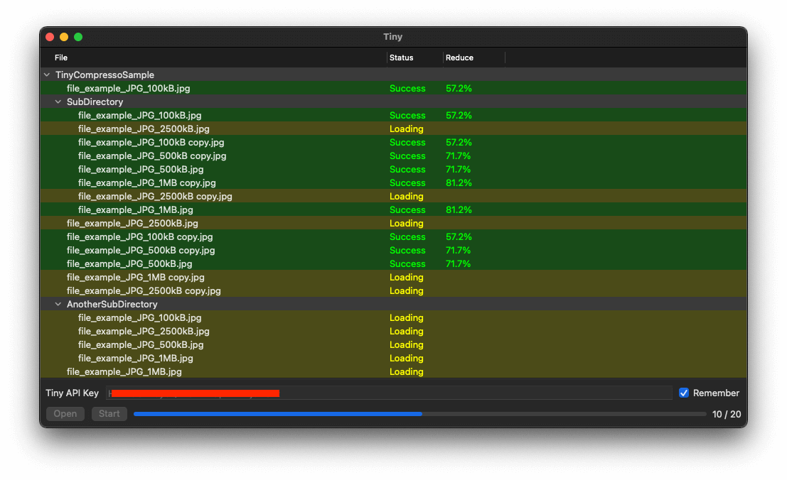
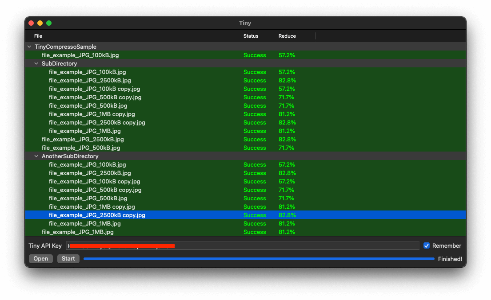
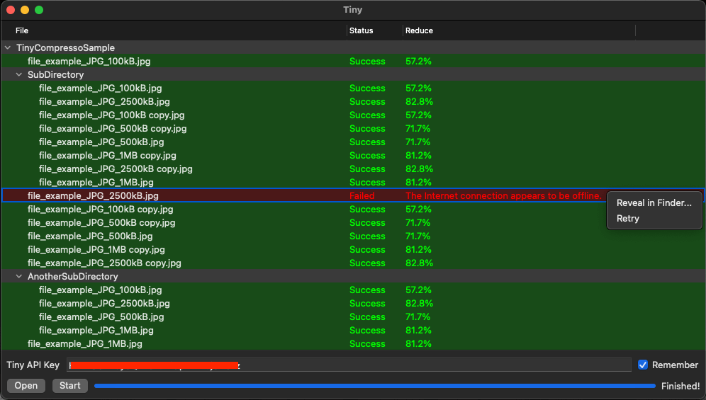

# Lightweight PNG and JPEG compressor for Mac - TinyPng client

Mac OS app provide an easy GUI for image compression.

The app built rely on [TinyPng](https://tinypng.com) service.

## 🔑 Features

- **Universal app supports both Intel or Apple Silicon**
- Works with PNG/APNG and JPEG format.
- Support individual file, multiple files or fully recursive image directory.
- Concurrent processing (max 10 files).
- Retry if any failure.
- Colorize status and simple UI.
- Reveal file in Finder.

## 🏗 Future support

- Drag and drop.
- Multiple directories.
- Retry all failures.
- Export location.
- Apple shortcut.

## 🚀 Released

**v1.0.3**

- **Universal app supports both Intel or Apple Silicon**
- Mirroring to [Github repo](https://github.com/HocTran/TinyCompressor).
- [Download](https://bitbucket.org/HocTran/tinycompressor/downloads/Tiny_v1.0.3.app.zip)

**v1.0.2**

- License updated (MIT).
- Api key remember check box.
- [Download](https://bitbucket.org/HocTran/tinycompressor/downloads/Tiny_v1.0.2.app.zip)

## How to use

- **(Only for first time download)**. You may got the prevention from **Mac Gatekeeper**

  > Tiny_v1.0.2 can’t be opened because it is from an unidentified developer.
  
  To temporarily bypass Gatekeeper, right-click (or **Control-click**) on the app’s icon and select **Open**.

  You’ll still receive an alert message, but this time it’s only a warning. Clicking **Open** again will launch the app.

- Input your **Tiny key**. See it in the [dashboard page](https://tinypng.com/dashboard/api).
- Press **"Open"** to select the files of images or images directory.
- Press **"Start"** and ... done 🎉.
All original images will be replaced by new compressed images.

  **Note**: Export location option is being built, please backup your original images if needed before process.

## License
Tiny is released under the MIT license. See [LICENSE](./LICENSE.md) for details.

## Screenshots

